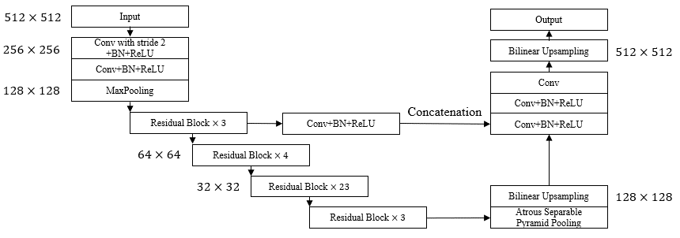

# Implementation of DeepLabV3+ using PyTorch Deep Learning Framework

The architecture was inspired by Attention-guided version of 2D UNet for automatic brain tumor segmentation. 

## Overview
This repository contains an unofficial implementation of DeepLabV3+ using PyTorch.<br/>
Please refer to the paper at the following page: 
[Encoder-decoder with atrous separable convolution for semantic image segmentation](https://openaccess.thecvf.com/content_ECCV_2018/html/Liang-Chieh_Chen_Encoder-Decoder_with_Atrous_ECCV_2018_paper.html "Visit")

## Model

## Paper
If you use this software for your research, please cite:

```bibtex
@inproceedings{chen2018encoder,
  title={Encoder-decoder with atrous separable convolution for semantic image segmentation},
  author={Chen, Liang-Chieh and Zhu, Yukun and Papandreou, George and Schroff, Florian and Adam, Hartwig},
  booktitle={Proceedings of the European conference on computer vision (ECCV)},
  pages={801--818},
  year={2018}
}
```

## License
This program is available for download for non-commercial use, licensed under the GNU General Public License. This allows its use for research purposes or other free software projects but does not allow its incorporation into any type of commercial software.

## Files
The repository contains the following files:

- `DeepLab_V3_Plus.py`: Python script file, containing the PyTorch implementation of the DeepLabV3+.
- `README.md`: Markdown file explaining the model source code.
